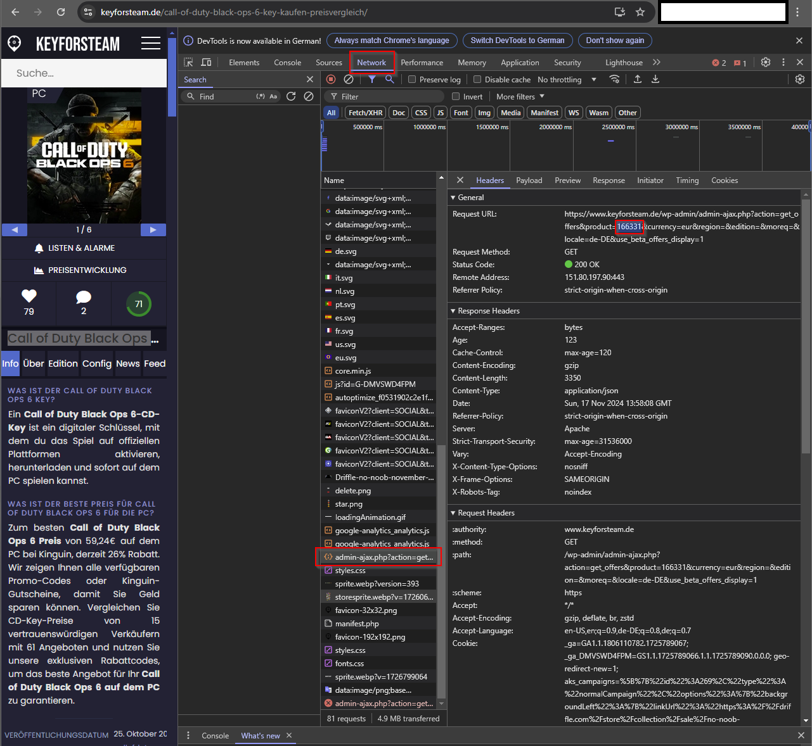

[](https://github.com/hacs/integration)
# Key for Steam Homeassistant Sensor
The `keyforsteam` sensor will give you informations about the the lowest price for a key game.

## Installation
### 1. Using HACS (recommended way)

This integration is a custom HACS Integration.

Open HACS then install the "keyforsteam" integration or use the link below.

[](https://my.home-assistant.io/redirect/hacs_repository/?owner=FaserF&repository=ha-keyforsteam&category=integration)

If you use this method, your component will always update to the latest version.

### 2. Manual

- Download the latest zip release from [here](https://github.com/FaserF/ha-keyforsteam/releases/latest)
- Extract the zip file
- Copy the folder "keyforsteam" from within custom_components with all of its components to `<config>/custom_components/`

where `<config>` is your Home Assistant configuration directory.

>__NOTE__: Do not download the file by using the link above directly, the status in the "master" branch can be in development and therefore is maybe not working.

## Configuration

Go to Configuration -> Integrations and click on "add integration". Then search for "keyforsteam".

[](https://my.home-assistant.io/redirect/config_flow_start/?domain=keyforsteam)

### Getting the product ID
Right now there is no nice way to fetch the product ID. The way I am doing it is by going to the keyforsteam page, pressing F12 to open the Browser developer tools -> Go to network -> Have a look for a name beginning like this: "admin-ajax.php?action=get ...
Then open this and have a look at the Request URL. Please copy the number after "?product="



### Configuration Variables
- **product id**: The game product ID from the website
- **currency**: The currency you want to see the prices in. IMPORTANT: If the product only has one currency, fetching will fail if another currency is selected.

## Automation example
```yaml
alias: Notify on Game Price Drop
description: 'Send a notification when the priceCard of the sensor falls below 55.'
trigger:
  - platform: numeric_state
    entity_id: sensor.keyforsteam_<product_id>  # Change <product_id> with the ID of your game
    attribute: priceCard
    below: 55
condition:
  - condition: template
    value_template: "{{ as_timestamp(now()) - as_timestamp(states.automation.notify_on_game_price_drop.attributes.last_triggered) | int > 86400 }}" #86400 seconds = 7 days -> Do not trigger the automation more than once a week
action:
  - service: notify.notify
    data:
      message: >
        Your game {{ state_attr('sensor.keyforsteam_<product_id>', 'game_id') }} has reached the price
        {{ state_attr('sensor.keyforsteam_<product_id>', 'priceCard') }} at the merchant
        {{ state_attr('sensor.keyforsteam_<product_id>', 'merchant') }} with Code
        {{ state_attr('sensor.keyforsteam_<product_id>', 'coupon') }} -
        Check it out at https://www.keyforsteam.de/
mode: single
```

## Bug reporting
Open an issue over at [github issues](https://github.com/FaserF/ha-keyforsteam/issues). Please prefer sending over a log with debugging enabled.

To enable debugging enter the following in your configuration.yaml

```yaml
logger:
    logs:
        custom_components.keyforsteam: debug
```

You can then find the log in the HA settings -> System -> Logs -> Enter "keyforsteam" in the search bar -> "Load full logs"

## Thanks to
The data is coming from the corresponding [keyforsteam.de](https://www.keyforsteam.de/) website.